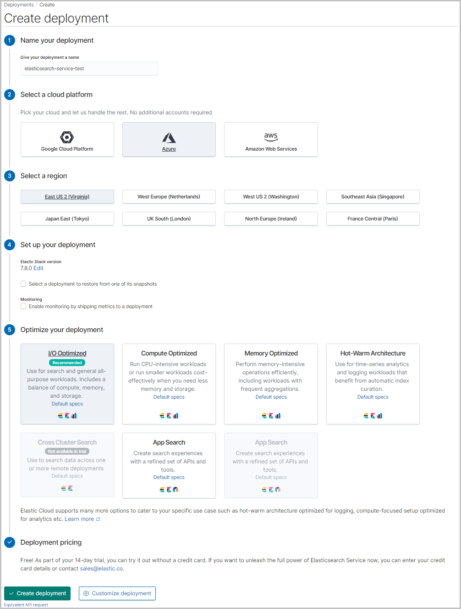
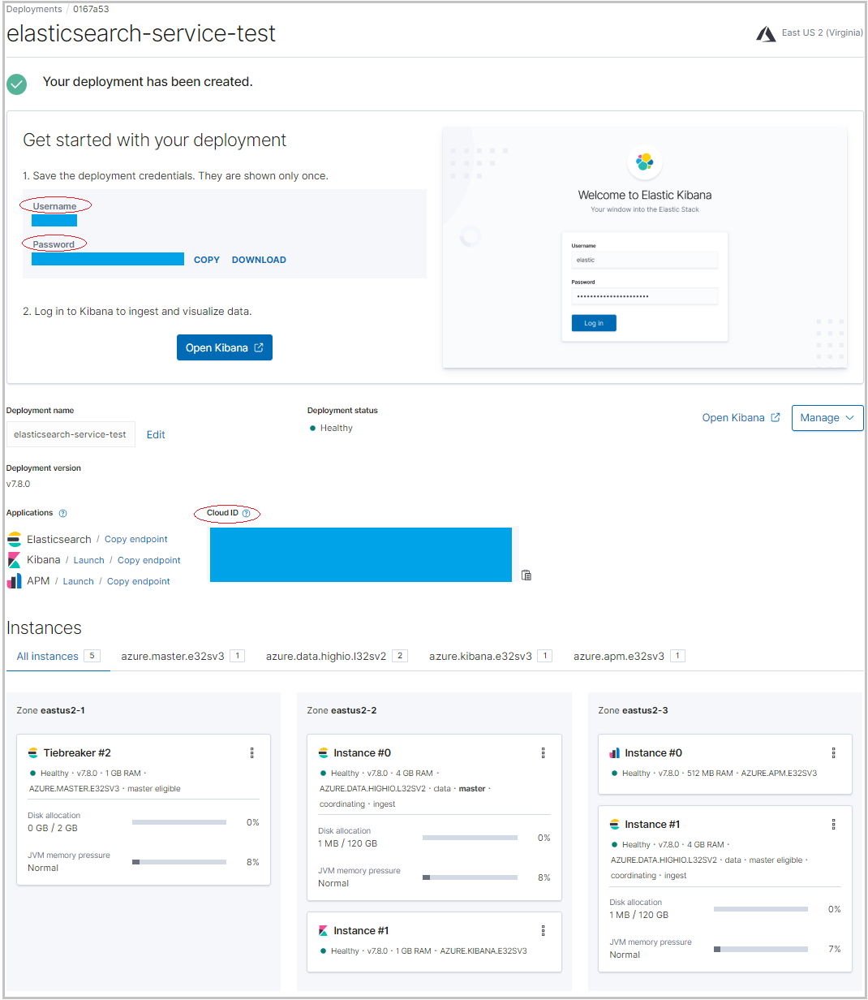
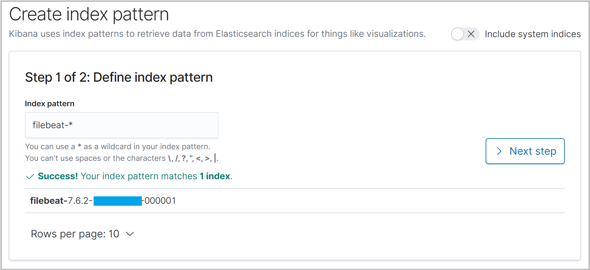
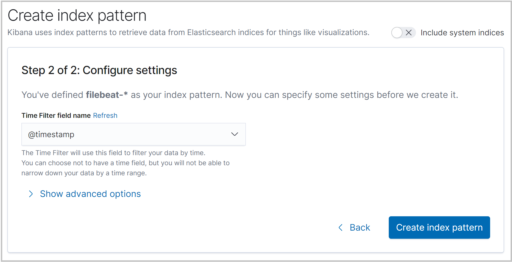
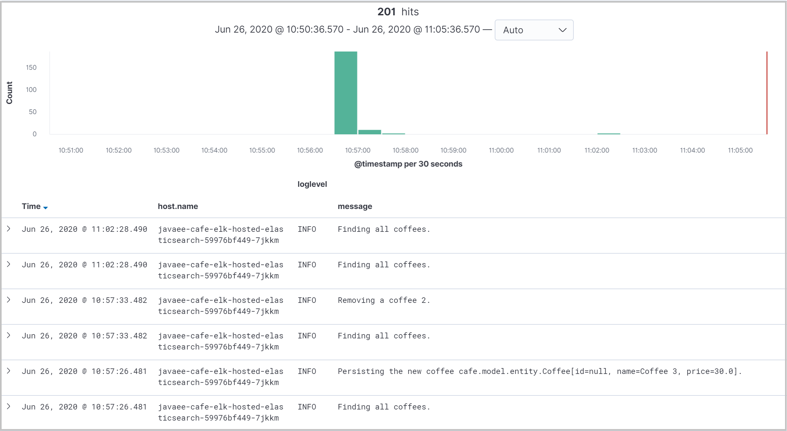

# Integrate your Liberty application with Managed Elasticsearch on Microsoft Azure

In this guide, you will integrate your Liberty application with Managed Elasticsearch on Microsoft Azure to enable distributed logging. The Liberty application is running on an Azure Red Hat OpenShift (ARO) 4 cluster. You learn how to:
> [!div class="checklist"]
>
> * Create a Managed Elasticsearch on Microsoft Azure
> * Deploy application with Filebeat to retrieve and ship application logs
> * Visualize your application logs in Kibana

## Before you begin

In previous guide, a Java application, which is running inside Open Liberty/WebSphere Liberty runtime, is deployed to an ARO 4 cluster. If you have not done these steps, start with [Deploy a Java application with Open Liberty/WebSphere Liberty on an Azure Red Hat OpenShift 4 cluster](howto-deploy-java-openliberty-app.md) and return here to continue.

### Create a Managed Elasticsearch on Microsoft Azure

Elasticsearch Service on Elastic Cloud is the only hosted Elasticsearch and Kibana offering available powered by the creators. It's simple to get up and running — scale with a click, configure with a slider. Choose Microsoft Azure for your deployment and you're on your way to simple management and powerful customization.

Follow the instructions below to create a deployment for the hosted Elasticsearch Service on Microsoft Azure.

1. Sign up for a [free trial](https://www.elastic.co/azure).
2. Log into [Elastic Cloud](https://cloud.elastic.co/login) using your free trial account.
3. Click **Create deployment**.
4. **Name your deployment** > Select **Azure as cloud platform** > **Leave defaults for others** or customize per your needs > Click **Create deployment**.

   
5. Wait until the deployment is created.

   
6. Write down **User name**, **Password**, and **Cloud ID** for later usage.

## Deploy application with Filebeat to retrieve and ship application logs

The application `<path-to-repo>/2-simple` used in the [previous guide](howto-deploy-java-openliberty-app.md) is ready to write logs to `messages.log` file, using Java Logging API `java.util.logging`. With logging in `JSON` format is configured, Filebeat can run as a side-container to collect and ship logs from `messages.log` file to the hosted Elasticsearch Service on Microsoft Azure.

To configure Filebeat as a side container to retrieve and ship application logs, a number of Kubernetes resource YAML files need to be updated or created.

| File Name             | Source Path                     | Destination Path              | Operation  | Description           |
|-----------------------|---------------------------------|-------------------------------|------------|-----------------------|  
| `filebeat-svc-account.yaml` | | [`<path-to-repo>/3-integration/elk-logging/hosted-elasticsearch/filebeat-svc-account.yaml`](https://github.com/Azure-Samples/open-liberty-on-aro/blob/master/3-integration/elk-logging/hosted-elasticsearch/filebeat-svc-account.yaml) | New | A Kubernetes **ServiceAccount** resource which is used for Filebeat container. |
| `filebeat-config.yaml` | | [`<path-to-repo>/3-integration/elk-logging/hosted-elasticsearch/filebeat-config.yaml`](https://github.com/Azure-Samples/open-liberty-on-aro/blob/master/3-integration/elk-logging/hosted-elasticsearch/filebeat-config.yaml) | New | A Kubernetes **ConfigMap** resource which is used as the Filebeat configuration file. |
| `elastic-cloud-secret.yaml` | | [`<path-to-repo>/3-integration/elk-logging/hosted-elasticsearch/elastic-cloud-secret.yaml`](https://github.com/Azure-Samples/open-liberty-on-aro/blob/master/3-integration/elk-logging/hosted-elasticsearch/elastic-cloud-secret.yaml) | New | A Kubernetes **Secret** resource with hosted Elasticsearch Service connection credentials, including `elastic.cloud.id`, and `elastic.cloud.auth`. |
| `openlibertyapplication.yaml` | [`<path-to-repo>/2-simple/openlibertyapplication.yaml`](https://github.com/Azure-Samples/open-liberty-on-aro/blob/master/2-simple/openlibertyapplication.yaml) | [`<path-to-repo>/3-integration/elk-logging/hosted-elasticsearch/openlibertyapplication.yaml`](https://github.com/Azure-Samples/open-liberty-on-aro/blob/master/3-integration/elk-logging/hosted-elasticsearch/openlibertyapplication.yaml) | Updated | Configure Filebeat as sidecar container. |

For reference, you can find these deployment files from `<path-to-repo>/3-integration/elk-logging/hosted-elasticsearch` of your local clone.

Now you can deploy the sample Liberty application to the ARO 4 cluster with the following steps.

1. Log in to the OpenShift web console from your browser using the credentials of the administrator.
2. [Log in to the OpenShift CLI with the token for the administrator](howto-deploy-java-openliberty-app.md#log-in-to-the-openshift-cli-with-the-token).
3. Run the following commands to deploy the application.

   ```bash
   # Change directory to "<path-to-repo>/3-integration/elk-logging/hosted-elasticsearch"
   cd <path-to-repo>/3-integration/elk-logging/hosted-elasticsearch

   # Change project to "open-liberty-demo"
   oc project open-liberty-demo

   # Create ServiceAccount "filebeat-svc-account"
   oc create -f filebeat-svc-account.yaml

   # Grant the service account access to the privileged security context constraints
   oc adm policy add-scc-to-user privileged -n open-liberty-demo -z filebeat-svc-account

   # Create ConfigMap "filebeat-config"
   oc create -f filebeat-config.yaml

   # Create environment variables which will be passed to secret "elastic-cloud-secret"
   # Note: replace "<Cloud ID>", "<User name>", and "<Password>" with the ones you noted down before
   export ELASTIC_CLOUD_ID=<Cloud ID>
   export ELASTIC_CLOUD_AUTH=<User name>:<Password>

   # Create secret "elastic-cloud-secret"
   envsubst < elastic-cloud-secret.yaml | oc create -f -

   # Create OpenLibertyApplication "javaee-cafe-elk-hosted-elasticsearch"
   oc create -f openlibertyapplication.yaml

   # Check if OpenLibertyApplication instance is created
   oc get openlibertyapplication javaee-cafe-elk-hosted-elasticsearch

   # Check if deployment created by Operator is ready
   oc get deployment javaee-cafe-elk-hosted-elasticsearch

   # Get host of the route
   HOST=$(oc get route javaee-cafe-elk-hosted-elasticsearch --template='{{ .spec.host }}')
   echo "Route Host: $HOST"
   ```

Once the Liberty Application is up and running:

1. Open the output of **Route Host** in your browser to visit the application home page.
2. To generate application logs, **Create a new coffee** and **Delete an existing coffee** in the application home page.

## Visualize your application logs in Kibana

As long as the application logs are shipped to the Elasticsearch cluster, they can be visualized in the Kibana web console.

1. Log into [Elastic Cloud](https://cloud.elastic.co/login).
2. Find your deployment from **Elasticsearch Service**, click **Kibana** to open its web console.
3. From the top-left of the Kibana home page, click menu icon to expand the top-level menu items. Click **Stack Management** > **Index Patterns** > **Create index pattern**.

   
4. Set **filebeat-\*** as index pattern. Click **Next step**.

   
5. Select **@timestamp** as **Time Filter field name** > Click **Create index pattern**.
6. From the top-left of the Kibana home page, click menu icon to expand the top-level menu items. Click **Discover**. Check index pattern **filebeat-\*** is selected.
7. Add **host&#46;name**, **loglevel**, and **message** from **Available fields** into **Selected fields**. Discover application logs from the work area of the page.

   

## Next steps

In this guide, you learned how to:
> [!div class="checklist"]
>
> * Create a Managed Elasticsearch on Microsoft Azure
> * Deploy application with Filebeat to retrieve and ship application logs
> * Visualize your application logs in Kibana

Advance to these guides, which integrate Liberty application with other Azure services:
> [!div class="nextstepaction"]
> [Integrate your Liberty application with Elasticsearch stack running inside OpenShift](howto-integrate-elasticsearch-operator.md)

> [!div class="nextstepaction"]
> [Integrate your Liberty application with Azure managed databases](howto-integrate-azure-managed-databases.md)

> [!div class="nextstepaction"]
> [Integrate your Liberty application with Azure Active Directory OpenID Connect](howto-integrate-aad-oidc.md)

If you've finished all of above guides, advance to the complete guide, which incorporates all of Azure service integrations:
> [!div class="nextstepaction"]
> [Integrate your Liberty application with different Azure services](howto-integrate-all.md)

Here are references used in this guide:

* [Managed Elasticsearch on Microsoft Azure](https://www.elastic.co/azure)
* [Run Filebeat on Kubernetes](https://www.elastic.co/guide/en/beats/filebeat/current/running-on-kubernetes.html)
* [Open Liberty logging and tracing](https://www.openliberty.io/docs/20.0.0.10/reference/config/logging.html)
* [Open Liberty Environment Variables](https://github.com/OpenLiberty/open-liberty-operator/blob/master/doc/user-guide.adoc#open-liberty-environment-variables)
