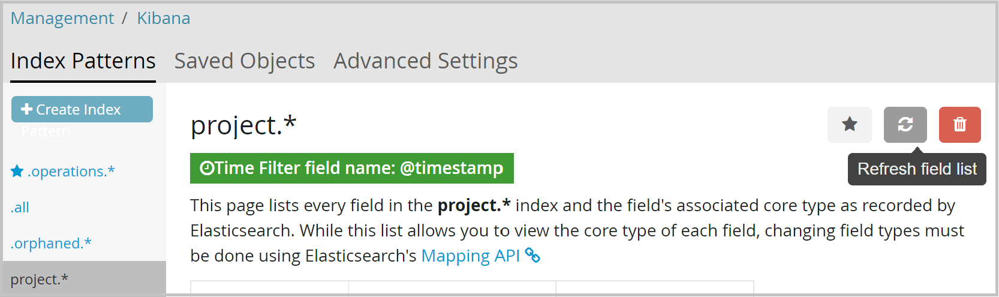
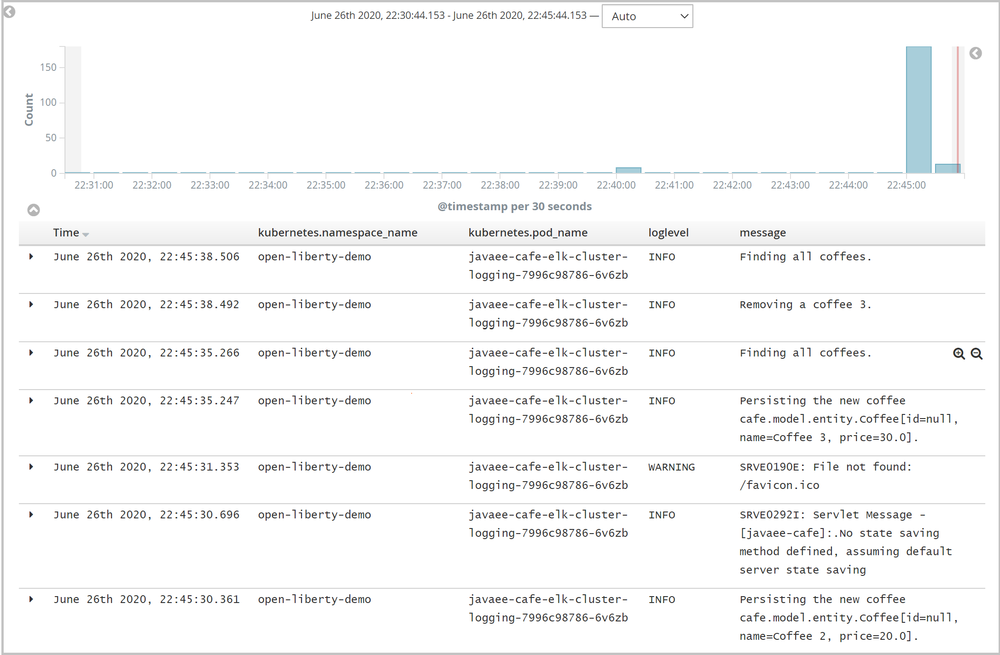

# Integrate your Liberty application with Elasticsearch stack running inside OpenShift

In this guide, you will integrate your Liberty application with Elasticsearch stack running inside OpenShift to enable distributed logging. The Liberty application is running on an Azure Red Hat OpenShift (ARO) 4 cluster. You learn how to:
> [!div class="checklist"]
>
> * Deploy cluster logging inside OpenShift cluster
> * Deploy sample application
> * Visualize your application logs in Kibana

## Before you begin

In previous guide, a Java application, which is running inside Open Liberty/WebSphere Liberty runtime, is deployed to an ARO 4 cluster. If you have not done these steps, start with [Deploy a Java application with Open Liberty/WebSphere Liberty on an Azure Red Hat OpenShift 4 cluster](howto-deploy-java-openliberty-app.md) and return here to continue.

### Deploy cluster logging inside OpenShift cluster

To enable cluster logging inside OpenShift cluster, you can install EFK (Elasticsearch, Fluentd, and Kibana) stack on the ARO 4 cluster, which aggregates log data from all containers running on the cluster.
> [!NOTE]
> Elasticsearch is a memory-intensive application. Refer to section [Set up Azure Red Hat OpenShift cluster](howto-deploy-java-openliberty-app.md#set-up-azure-red-hat-openshift-cluster) from the previous guide to learn how to specify appropriate virtual machine size for the worker nodes when creating the cluster.

Follow the instructions in these tutorials and then return here to continue.

1. Log in to the OpenShift web console from your browser using the `kubeadmin` credentials.
2. [Log in to the OpenShift CLI with the token for `kubeadmin`](howto-deploy-java-openliberty-app.md#log-in-to-the-openshift-cli-with-the-token).
3. Install the Elasticsearch Operator by following the steps in [Install the Elasticsearch Operator using the CLI](https://docs.openshift.com/container-platform/4.3/logging/cluster-logging-deploying.html#cluster-logging-deploy-eo-cli_cluster-logging-deploying).
4. Install the Cluster Logging Operator by following the steps in [Install the Cluster Logging Operator using the CLI](https://docs.openshift.com/container-platform/4.3/logging/cluster-logging-deploying.html#cluster-logging-deploy-clo-cli_cluster-logging-deploying).
   > [!NOTE]
   > To specify the name of an existing **StorageClass** for Elasticsearch storage in step **Create a Cluster Logging instance**, open **ARO web console** > **Storage** > **Storage Classes** and find the supported storage class name.

After the newly created Cluster Logging instance is up and running, configure Fluentd to merge the JSON log message bodies emitted by sample application.

1. Switch to project `openshift-logging`:

   ```bash
   oc project openshift-logging
   ```

2. Change the cluster logging instance’s **managementState** field from **Managed** to **Unmanaged**:

   ```bash
   oc edit ClusterLogging instance
   ```

3. Set the environment variable **MERGE_JSON_LOG** to **true**:

   ```bash
   oc set env ds/fluentd MERGE_JSON_LOG=true
   ```

## Deploy sample application

The application `<path-to-repo>/2-simple` used in the [previous guide](howto-deploy-java-openliberty-app.md) is ready to write logs to `messages.log` file, using Java Logging API `java.util.logging`. With the **Open Liberty Operator**, which sets JSON as console log format and includes message as one of log sources, the application logs will be parsed by Fluentd and posted to Elasticsearch cluster.

To distribute your application logs to EFK stack, a number of Kubernetes resource YAML files need to be updated or created.

| File Name             | Source Path                     | Destination Path              | Operation  | Description           |
|-----------------------|---------------------------------|-------------------------------|------------|-----------------------|  
| `openlibertyapplication.yaml` | [`<path-to-repo>/2-simple/openlibertyapplication.yaml`](https://github.com/Azure-Samples/open-liberty-on-aro/blob/master/2-simple/openlibertyapplication.yaml) | [`<path-to-repo>/3-integration/elk-logging/cluster-logging/openlibertyapplication.yaml`](https://github.com/Azure-Samples/open-liberty-on-aro/blob/master/3-integration/elk-logging/cluster-logging/openlibertyapplication.yaml) | Updated | Changed name to `javaee-cafe-elk-cluster-logging`. |

For reference, you can find these deployment files from `<path-to-repo>/3-integration/elk-logging/cluster-logging` of your local clone.

Now you can deploy the sample Liberty application to the ARO 4 cluster with the following steps.

1. Log in to the OpenShift web console from your browser using the credentials of the administrator.
2. [Log in to the OpenShift CLI with the token for the administrator](howto-deploy-java-openliberty-app.md#log-in-to-the-openshift-cli-with-the-token).
3. Run the following commands to deploy the application.

   ```bash
   # Change directory to "<path-to-repo>/3-integration/elk-logging/cluster-logging"
   cd <path-to-repo>/3-integration/elk-logging/cluster-logging

   # Change project to "open-liberty-demo"
   oc project open-liberty-demo

   # Create OpenLibertyApplication "javaee-cafe-elk-cluster-logging"
   oc create -f openlibertyapplication.yaml

   # Check if OpenLibertyApplication instance is created
   oc get openlibertyapplication javaee-cafe-elk-cluster-logging

   # Check if deployment created by Operator is ready
   oc get deployment javaee-cafe-elk-cluster-logging

   # Get host of the route
   HOST=$(oc get route javaee-cafe-elk-cluster-logging --template='{{ .spec.host }}')
   echo "Route Host: $HOST"
   ```

Once the Liberty Application is up and running:

1. Open the output of **Route Host** in your browser to visit the application home page.
2. To generate application logs, **Create a new coffee** and **Delete an existing coffee** in the application home page.

## Visualize your application logs in Kibana

As long as the application logs are shipped to the Elasticsearch cluster, they can be visualized in the Kibana web console.

1. Log in to the OpenShift web console from your browser using the `kubeadmin` credentials. Click **Monitoring** > **Logging**.
2. In the new opened window, click **Log in with OpenShift**. Log in with `kubeadmin` if required.
3. In **Authorize Access** page, click **Allow selected permissions**. Wait until the Kibana web console is displayed.
4. Open **Management** > **Index Patterns** > Select **project.\*** > Click **Refresh field list** icon at top-right of the page.

   
5. Click **Discover**. Select index pattern **project.\*** from the dropdown list.
6. Add **kubernetes.namespace_name**, **kubernetes.pod_name**, **loglevel**, and **message** from **Available Fields** into **Selected Fields**. Discover application logs from the work area of the page.

   

If you want to log in using the administrator to view logs in the Kibana web console, follow the steps above but replace index pattern **project.\*** with **project.open-liberty-demo.\<random-guid>.\***.

## Next steps

In this guide, you learned how to:
> [!div class="checklist"]
>
> * Deploy cluster logging inside OpenShift cluster
> * Deploy sample application
> * Visualize your application logs in Kibana

Advance to these guides, which integrate Liberty application with other Azure services:
> [!div class="nextstepaction"]
> [Integrate your Liberty application with Managed Elasticsearch on Microsoft Azure](howto-integrate-elasticsearch-managed.md)

> [!div class="nextstepaction"]
> [Integrate your Liberty application with Azure managed databases](howto-integrate-azure-managed-databases.md)

> [!div class="nextstepaction"]
> [Integrate your Liberty application with Azure Active Directory OpenID Connect](howto-integrate-aad-oidc.md)

If you've finished all of above guides, advance to the complete guide, which incorporates all of Azure service integrations:
> [!div class="nextstepaction"]
> [Integrate your Liberty application with different Azure services](howto-integrate-all.md)

Here are references used in this guide:

* [Deploying cluster logging](https://docs.openshift.com/container-platform/4.3/logging/cluster-logging-deploying.html)
* [Configure Fluentd to merge JSON log message body](https://kabanero.io/guides/app-logging-ocp-4-2/#configure-fluentd-to-merge-json-log-message-body)
* [Open Liberty logging and tracing](https://www.openliberty.io/docs/20.0.0.10/reference/config/logging.html)
* [Open Liberty Environment Variables](https://github.com/OpenLiberty/open-liberty-operator/blob/master/doc/user-guide.adoc#open-liberty-environment-variables)
